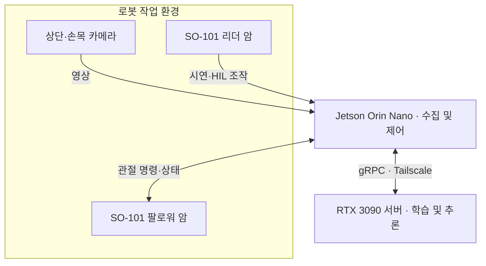
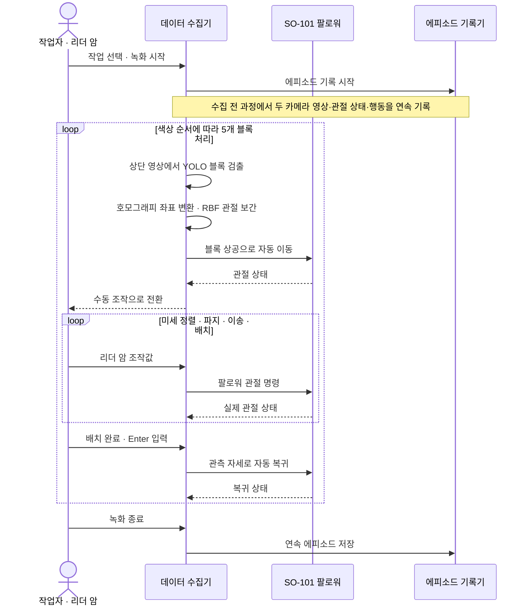
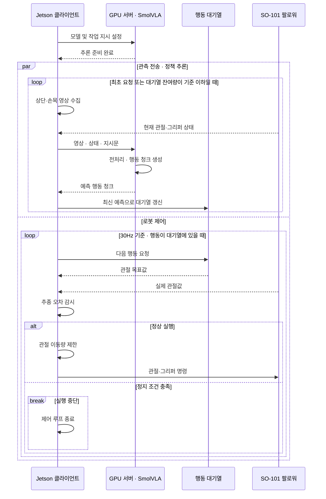

# LeRobot SO-101을 활용한 지능형 로봇 팔 제어

2026 전기 부산대학교 정보컴퓨터공학부 졸업과제 37팀 **선넘지마** · 지도교수 백윤주

SO-101 로봇 팔이 무작위로 놓인 5개 블록을 지정 영역에 정리하거나 수직으로 적층합니다. 상단·손목 카메라와 관절 상태를 입력받는 **단일 SmolVLA 모델**을 사용하며, 자연어 지시문으로 작업을 전환합니다. 시연 수집과 학습은 LeRobot을 기반으로 구성하고, GPU 서버의 추론 결과를 로봇 클라이언트가 비동기로 실행합니다.

---

## 1. 프로젝트 배경

### 1.1. 국내외 기술 동향 및 문제점

LeRobot과 ACT·SmolVLA 등의 공개 기술을 활용하면 사람이 시연한 동작을 학습하여 로봇을 제어할 수 있습니다. 그러나 여러 물체를 연속으로 조작하는 작업에서는 다음 문제가 발생합니다.

- **오차 누적:** 작은 파지·배치 오차가 다음 동작에 영향을 주어 전체 작업이 실패할 수 있습니다.
- **작업 간 간섭:** 같은 물체를 다루더라도 정리와 적층은 파지 이후의 이동·배치 행동이 다릅니다.
- **실패 복구 부족:** 성공 시연에 없는 상태에서는 작업을 이어가기 어렵습니다.
- **수집 부담:** 긴 작업을 반복 시연하면 시간과 조작 편차가 증가합니다.

### 1.2. 필요성과 기대효과

정리와 적층을 하나의 모델로 수행하려면 작업별 행동을 구분하는 학습 데이터와 안정적인 실행 환경이 필요합니다.

- **수집 효율화:** 반복적인 상공 접근은 자동화하고 정밀 조작은 사람이 시연합니다.
- **작업 전환:** 모델을 교체하지 않고 자연어 지시로 정리·적층을 구분합니다.
- **행동 개선:** 사람의 교정과 파지 이후 분기 데이터를 이용해 부족한 동작을 보강합니다.
- **개발 과정 공유:** 수집·학습·실행 코드와 실험 기록을 후속 연구에 제공합니다.

---

## 2. 개발 목표

### 2.1. 목표 및 세부 내용

**동일한 신경망 모델로 5개 블록의 정리와 적층을 수행하는 로봇 시스템**을 구현합니다.

| 구분 | 목표 | 조건 |
| --- | --- | --- |
| Task 1 — 정리 | 5개 블록을 20×10cm 지정 영역으로 이동 | 180초 이내, 배치 후 5초 유지 |
| Task 2 — 적층 | 5개 블록을 수직으로 적층 | 300초 이내, 적층 후 5초 유지 |
| 공통 | 동일 모델에서 지시문으로 작업 전환 | 상단·손목 영상과 관절 상태 사용 |

팀 내부 학습 기준은 **빨강 → 노랑 → 원목 → 초록 → 파랑** 순서이며, 정리는 지정 슬롯에 분리 배치하도록 시연했습니다.

### 2.2. 기존 방식 대비 차별성

| 구분 | 초기 접근 | 최종 구성 및 후속 개선 |
| --- | --- | --- |
| 작업 제어 | 인식·좌표·상태별 제어 조합 | SmolVLA가 관측과 지시에 따라 연속 행동 생성 |
| 데이터 수집 | 수동 시연 중심 | 자동 상공 접근 + 수동 파지·이송·배치 |
| 연속 작업 | 단일 블록·짧은 구간 중심 | 5블록 전체 작업을 한 에피소드로 기록 |
| 배치 편향 | 데이터 증량과 지시문 조정 | 파지 직후 분기 수집 및 PCGrad 실험 |
| 실패 대응 | 성공 시연 중심 학습 | HIL 교정 데이터와 보상 가중 학습 |

### 2.3. 사회적 가치 도입 계획

- **교육·연구 접근성:** 저비용 로봇과 공개 프레임워크로 구현 가능한 사례를 제공합니다.
- **재현 가능한 개발 자료:** 코드, 설정, 데이터 수집 절차와 실패 분석을 공유합니다.
- **반복 작업 확장:** 정리·분류·적층 등 소규모 자동화 작업으로의 적용 가능성을 검토합니다.

---

## 3. 시스템 설계

### 3.1. 시스템 구성도

Jetson은 데이터 수집과 로봇 제어를, GPU 서버는 정책 학습과 추론을 담당합니다.



### 3.2. 사용 기술

| 구분 | 기술 및 사양 |
| --- | --- |
| 로봇 | SO-101 리더·팔로워, Feetech STS3215 |
| 카메라 | 상단·손목 USB 카메라, 640×480·30fps·MJPG |
| 컴퓨팅 환경 | Jetson Orin Nano, RTX 3090 24GB, Ubuntu, Python 3.12 |
| 정책·프레임워크 | SmolVLA, Hugging Face LeRobot, PyTorch |
| 수집 자동화 | YOLO, OpenCV, 호모그래피, RBF 관절 보간 |
| 통신·학습 기록 | gRPC, Tailscale, Weights & Biases |

---

## 4. 개발 결과

### 4.1. 전체 시스템 흐름도

시연 데이터 수집 → 정책 학습 → 자율 실행으로 구성됩니다. 학습 및 추가 개선 과정은 4.2절에 정리했습니다.

#### ① 시연 데이터 수집

**상공 접근은 자동화하고, 파지·이송·배치는 사람이 시연합니다.** 자동 이동과 수동 조작을 포함한 5블록 전체 작업을 하나의 에피소드로 기록합니다.



#### ② 자율 실행

**동일한 SmolVLA 모델에서 지시문만 변경하여 정리·적층을 수행합니다.** 수집 단계의 YOLO·좌표 변환·RBF를 사용하지 않고, 모델이 관측과 지시문을 바탕으로 전체 조작 행동을 생성합니다.



서버의 추론과 클라이언트의 행동 실행을 병행하여, 다음 행동을 계산하는 동안에도 기존 행동을 이어서 수행합니다.

### 4.2. 기능 설명 및 주요 기능 명세서

#### 모델 개선 과정

초기 모델의 **중앙 배치 편향과 실패 복구 부족**을 개선하기 위해 데이터 보강과 후속 학습을 진행했습니다.

| 단계 | 적용 방법 | 결과 및 역할 |
| --- | --- | --- |
| **① 멀티태스크 모방학습** | 정리·적층 **575ep**로 Full Fine-Tuning | 두 작업의 수행을 확인했으나, 정리 지시에도 중앙으로 배치하는 편향 발생 |
| **② 추가 시연·HIL** | 추가 시연과 사람의 복구 동작으로 **865ep** 확보. 43ep 정제 후 **822ep**로 행동 생성부만 미세조정(Expert-only) | 실패 복구 데이터를 보강하고 정책 개선. 배치 편향은 일부 잔존 |
| **③ Same-Color PCGrad** | 822ep 모델을 기반으로 파지 이후 이송·배치 데이터 **247ep** 학습. 동일 색상의 두 작업 간 그래디언트 충돌을 직교 투영으로 교정 | **실물 시험에서 중앙 배치 편향 해소 확인** |

#### 보상 가중 학습 · RWFM

Reward-Weighted Flow Matching(RWFM)으로 구간별 Flow Matching 손실에 가중치를 적용했습니다. 실패 구간의 영향은 낮추고, 정상 수행과 사람의 교정 동작을 더 크게 반영했습니다.

| 실패 구간 | 정상 수행 구간 | 사람의 교정 구간 |
| :---: | :---: | :---: |
| 0.1 | 0.8 | 1.0 |


#### 주요 문제 해결

| 문제 | 수정 내용 |
| --- | --- |
| 영상 전처리 불일치 | 정규화 점검 및 종횡비 보존 패딩 적용 |
| 영상 증강과 행동 라벨 불일치 | 회전·평행 이동 증강 제외 |
| 관절별 제한으로 이동 방향 변화 | 관절 변화량에 공통 비율 제한 적용 |
| 파지 중 추종 오류 | 그리퍼 접촉과 팔 관절 추종 이상을 구분하여 감시 조건 검토 |

#### 결과 요약

| 평가 항목 | 결과 |
| --- | --- |
| **정리 작업** | 575ep 기준 모델의 내부 시험에서 5블록 전체 완료율 **80%**, 평균 **70초** |
| **적층 작업** | 동일 모델의 지시문을 변경하여 중앙 접근·상공 정렬·수직 배치 확인 |
| **배치 편향** | Same-Color PCGrad 적용 후 실물 시험에서 해소 확인 |
| **추가 평가 항목** | 후속 모델의 전체 완료율, 고단 적층 안정성, 실패 복구 성공률 |


### 4.3. 디렉토리 구조

### lerobot-project/ 디렉토리 구조

```text
lerobot-project/
├── project/                                          # [자체 개발] 프로젝트 설정 및 실행 스크립트
│   ├── config/                                           # [자체 개발] 캘리브레이션 및 제어 파라미터
│   │   ├── pixel_to_robot_homography.json                    # 34점 호모그래피 변환 행렬
│   │   ├── hover_joint_model_record.json                     # 45점 RBF 상공 호버 관절 보간 모델
│   │   ├── runtime.json                                      # 관절 이동 한계 및 워치독 설정
│   │   └── rwfm_final_rewards.json                           # 오프라인 강화학습(RWFM) 보상 맵
│   │
│   └── scripts/                                          # [자체 개발] 실행 런처 및 유틸리티
│       ├── robot/                                            # 실물 로봇 제어 및 수집
│       │   ├── run_smolvla_multitask_5blocks_inference.sh        # 5블록 자율 추론 런처
│       │   ├── run_async_inference.sh                            # 비동기 gRPC 클라이언트
│       │   ├── run_hybrid_5blocks_onetake_v3_record.sh           # Task 1 원테이크 수집기
│       │   └── run_hybrid_task2_stack_v1_record.sh               # Task 2 적층 수집기
│       │
│       ├── gpu/                                              # GPU 서버 실행
│       │   ├── run_smolvla_red_policy_server.sh                  # 정책 추론 서버 (Port 8080)
│       │   └── run_smolvla_822_same_color_pcgrad.sh              # PCGrad 교정 학습 런처
│       │
│       ├── train/                                            # 학습 알고리즘
│       │   └── train_smolvla_same_color_pcgrad.py                # Same-Color PCGrad 트레이너
│       │
│       └── tools/                                            # 분석 및 보상 생성
│           ├── analyze_smolvla_gradient_conflict.py              # 그래디언트 충돌 분석 도구
│           └── generate_frame_rewards.py                         # RWFM 프레임 보상 생성기
│
├── src/lerobot/                                      # 프레임워크 패키지 소스
│   ├── grad_project/                                     # [자체 개발] 제어·인식·수집·강화학습 엔진
│   │   ├── control/                                          # RBF 관절 보간 및 Coordinated Limiter
│   │   ├── perception/                                       # YOLOv11 검출 및 작업대 좌표 변환
│   │   ├── recording/                                        # 하이브리드 수집 및 파지 직후 분기 수집
│   │   └── rl/                                               # RWFM 오프라인 강화학습 모듈
│   │
│   ├── async_inference/                                  # [기존 제공 / 수정] 비동기 분산 통신
│   │   ├── policy_server.py                                  # gRPC 모델 서빙
│   │   ├── robot_client.py                                   # 클라이언트 루프
│   │   └── helpers.py                                        # [수정] 512x512 종횡비 보존 패딩 적용
│   │
│   └── policies/                                         # [기존 제공] 정책 신경망 백본
│       └── smolvla/                                          # SmolVLA 모델 구조
│
├── pyproject.toml                                      # [기존 제공] 패키지 빌드 설정
└── LICENSE                                             # [기존 제공] 라이선스
```


### 4.4. 산업체 멘토링 의견 및 반영 사항

중간 단계의 **OpenCV + FSM + ACT 구조**를 대상으로 자문을 받았습니다. 역할을 분리한 설계와 대체 정책 검토는 긍정적으로 평가받았으며, 데이터 확대·인식 안정화·전체 작업 검증을 보완 과제로 제안받았습니다.

| 주요 피드백 | 이후 반영 내용 |
| --- | --- |
| **데이터 확대·모델 단일화** — 제한된 색상·구역·회전 조건을 확대하고 단일 정책으로 통합 | 5개 색상과 다양한 배치의 연속 시연을 수집하고, 정리·적층을 하나의 SmolVLA 모델로 통합 |
| **인식 강건성 확보** — 조명·그림자에 따른 검출 불안정 개선, 필요시 YOLO 전환 | YOLO 기반 인식과 좌표 보정을 수집용 자동 접근에 활용하고, 최종 자율 실행은 SmolVLA로 구성 |
| **전체 작업 검증** — 단일 파지를 넘어 정리·적층의 전체 수행 평가 | 5블록 연속 실행과 체크포인트별 실물 시험 진행, HIL을 통한 실패 복구 데이터 보강 |
| **배포 환경 검증** — Jetson Orin Nano·Docker 환경 점검 | GPU 정책 서버와 로봇 클라이언트를 분리하고 Jetson의 장치 연결·통신 환경 구성 |
| **관련 연구 검토** — 기존 로봇 제어 논문을 참고하여 설계 보완 | ACT·SmolVLA·모방학습 관련 연구를 검토하고 정책 선정 및 후속 학습 설계에 반영 |

초기에 제안된 단일 ACT 파지 모델은 개발 과정에서 **전체 조작을 수행하는 단일 SmolVLA 정책**으로 전환했습니다.

---

## 5. 설치 및 실행 방법

### 5.1. 설치절차 및 실행 방법

#### 기본 설정 및 사용 가이드

SO-101의 초기 설정과 LeRobot 기본 기능 사용법은 [RoboSEasy SO-ARM101 가이드](https://roboseasy.ai/docs/a-ba)를 참고하세요.

- **초기 설정:** 로봇 조립, 소프트웨어 설치, USB·카메라 포트 고정, 캘리브레이션
- **기본 기능:** 텔레오퍼레이션, 데이터 수집·재생·시각화·편집, 모델 학습 및 추론

처음 사용하는 경우 위 가이드에 따라 장치 설정과 텔레오퍼레이션 동작을 확인한 뒤, 아래의 **프로젝트 소스 설치 및 서버·클라이언트 실행 절차**를 진행하세요. 프로젝트 실행에는 아래에 명시된 Python 환경과 제공 스크립트를 사용합니다.

**실행 환경**

- GPU 서버: Linux, NVIDIA GPU, CUDA 호환 PyTorch
- 로봇 클라이언트: Linux, SO-101 리더·팔로워, 카메라 2대
- Python 3.12, Conda
- GPU 서버와 클라이언트 간 네트워크 연결

**실행 순서: 환경 구성 → GPU 정책 서버 → 로봇 클라이언트**

**1) 소스 및 환경 구성**

```bash
git clone https://github.com/pnucse-capstone2026/capstone-2026-team-37.git
cd capstone-2026-team-37/lerobot-project

conda create -n lerobot python=3.12 -y
conda activate lerobot
python -m pip install -e ".[smolvla,async,feetech]"
```

YOLO 수집 기능은 `ultralytics`를 추가 설치합니다. Jetson은 ARM 환경에 맞는 의존성 구성이 필요합니다.

**2) GPU 정책 서버**

GPU 서버의 `lerobot-project/`에서 실행합니다.

```bash
conda activate lerobot
export LEROBOT_ROOT="$PWD"
bash project/scripts/gpu/run_smolvla_red_policy_server.sh
```

**3) 로봇 클라이언트**

로봇 PC의 `lerobot-project/`에서 서버 주소와 모델 경로를 설정합니다.

```bash
conda activate lerobot
export LEROBOT_ROOT="$PWD"

export SERVER_ADDRESS="GPU_SERVER_IP:8080"
export MODEL_PATH="/PATH/ON/GPU_SERVER/pretrained_model"

export ROBOT_PORT="/dev/so101_follower"
export TELEOP_PORT="/dev/so101_leader"
export TOP_CAM="/dev/cam_top"
export WRIST_CAM="/dev/cam_wrist"

unset TASK
```

- `SERVER_ADDRESS`: 실제 GPU 서버 주소
- `MODEL_PATH`: GPU 서버에서 접근 가능한 체크포인트
- 장치 경로와 캘리브레이션은 사용하는 로봇에 맞춰 설정합니다.

```bash
# Task 1: 정리
TASK_MODE=1 bash project/scripts/robot/run_smolvla_multitask_5blocks_inference.sh

# Task 2: 적층
TASK_MODE=2 bash project/scripts/robot/run_smolvla_multitask_5blocks_inference.sh
```

두 작업은 동일한 체크포인트를 사용합니다.

### 5.2. 오류 발생 시 해결 방법

| 증상 | 확인 및 해결 |
| --- | --- |
| 서버 연결 실패 | 서버 실행 여부, 주소·8080 포트, 네트워크 확인 |
| 장치 경로 없음 | USB 연결, 고정 경로, 접근 권한 확인 |
| 모델 로딩 실패 | GPU 서버의 체크포인트 경로·파일 확인 |
| 작업 지시가 바뀌지 않음 | `unset TASK` 후 재실행 |
| 파지 위치가 어긋남 | 카메라 위치·순서, 전처리, 관절 캘리브레이션 확인 |
| 관절 추종 오류 | 오류 관절의 목표·실제 값과 물체 접촉 여부 확인 |

---

## 6. 소개 자료 및 시연 영상

### 6.1. 프로젝트 소개 자료

- [착수·중간·최종보고서](docs/01.보고서/)
- [포스터](docs/02.포스터/)
- [발표자료](docs/03.발표자료/)

### 6.2. 시연 영상

[](https://www.youtube.com/watch?v=AhXSxbBg39s)
---

## 7. 팀 구성

### 7.1. 팀원별 소개 및 역할 분담

| 이름 | 담당 | 주요 수행 내용 |
| --- | --- | --- |
| 천성민 | 정책 학습·추론 | SmolVLA 멀티태스크 학습, 비동기 추론, PCGrad·RWFM |
| 김도환 | 학습 분석·데이터 | ACT 실험 분석, 시연·분기 데이터 정제, 체크포인트 실물 평가 |
| 김혜은 | 인식·수집 자동화 | OpenCV·YOLO, 좌표 보정, RBF 보간, 자동 상공 접근 |

공통: 하드웨어 구성, 시연 수집, 통합 시험, 보고서 및 발표자료 작성

### 7.2. 팀원별 참여 후기

- **천성민:** 같은 모델에서도 데이터 분포와 지시문에 따라 배치 행동이 달라지는 것을 확인했습니다. 분기 데이터와 후속 학습을 적용하며 모델 수정과 실물 검증을 함께 진행하는 경험을 쌓았습니다.
- **김도환:** 데이터의 양뿐 아니라 시연 품질과 영상·행동의 정합성이 중요하다는 점을 배웠습니다. 학습 손실과 실물 결과를 함께 비교하며 데이터 정제와 평가를 진행했습니다.
- **김혜은:** 영상 좌표를 실제 로봇 동작으로 연결하면서 시차와 서보 처짐 등 다양한 오차를 다뤘습니다. 실측 보정과 반복 시험을 통해 인식·제어 모듈을 수집 자동화에 연결했습니다.

---

## 8. 참고 문헌 및 출처

1. [SmolVLA: A Vision-Language-Action Model for Affordable and Efficient Robotics](https://arxiv.org/abs/2506.01844), 2025.
2. [Gradient Surgery for Multi-Task Learning](https://arxiv.org/abs/2001.06782), NeurIPS, 2020.
3. [Hugging Face LeRobot](https://github.com/huggingface/lerobot).
4. [Learning Fine-Grained Bimanual Manipulation with Low-Cost Hardware](https://arxiv.org/abs/2304.13705), 2023.
5. [Flow Matching for Generative Modeling](https://arxiv.org/abs/2210.02747), 2023.
6. [Ultralytics YOLO](https://github.com/ultralytics/ultralytics).

### 오픈소스 활용

본 프로젝트는 [Hugging Face LeRobot](https://github.com/huggingface/lerobot)을 기반으로 개발했습니다. `lerobot-project/`에는 LeRobot 원본 코드와 본 과제를 위해 수정·추가한 코드가 포함되어 있습니다.

**주요 수정·추가 내용**

- 자동 상공 접근과 수동 조작을 결합한 연속 시연 수집
- 프로젝트용 비동기 추론 실행 구성 및 관절 제어·진단 기능
- HIL 교정 데이터 수집·정제 도구
- Same-Color Paired PCGrad 및 보상 가중 학습 기능

원본 코드의 저작권·라이선스 표기를 유지하며, 자세한 내용은 [LICENSE](lerobot-project/LICENSE)를 참고하시기 바랍니다.