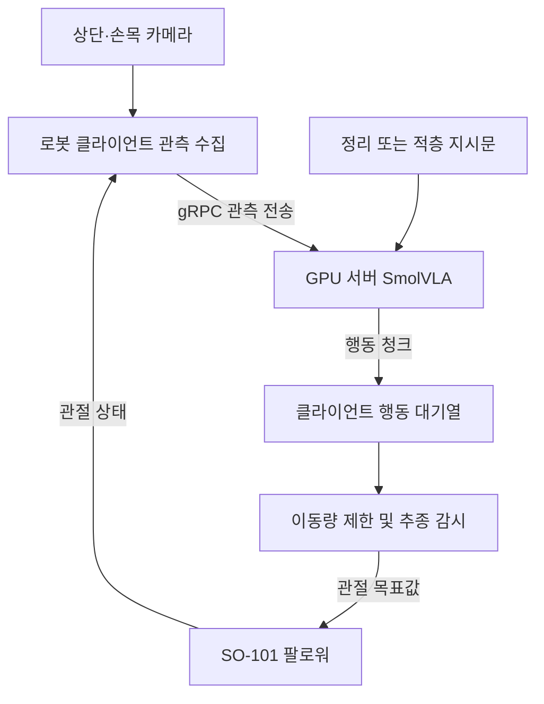

# LeRobot SO-101을 활용한 지능형 로봇 팔 제어

**부산대학교 정보컴퓨터공학부 2026 전기 졸업과제 · 37팀 선넘지마**

SO-101 로봇 팔과 SmolVLA를 이용하여 무작위로 놓인 5개 블록을 정리하거나 수직으로 적층하는 프로젝트입니다. 상단·손목 카메라 영상, 관절 상태, 자연어 지시를 입력받아 로봇의 행동을 생성하며, **하나의 모델에서 지시문을 변경하여 두 작업을 수행하도록 구성**했습니다.

Hugging Face의 LeRobot을 기반으로 시연 데이터 수집, 정책 미세조정, GPU 서버와 로봇 클라이언트 간 비동기 추론 환경을 개발했습니다. 이 저장소는 학과 제출 문서와 프로젝트에서 수정·확장한 LeRobot 소스를 함께 제공합니다.

| 항목 | 내용 |
| --- | --- |
| 팀명 | 선넘지마 |
| 팀원 | 김도환 · 천성민 · 김혜은 |
| 지도교수 | 백윤주 교수님 |
| 로봇 | SO-101 리더·팔로워 암 |
| 정책 | SmolVLA 기반 멀티태스크 모방학습 |
| 관측 | 상단 영상 + 손목 영상 + 6개 관절·그리퍼 상태값 |
| 작업 | 5개 블록 정리 / 5개 블록 수직 적층 |

[보고서](docs/01.보고서/) · [포스터](docs/02.포스터/) · [발표자료](docs/03.발표자료/) · [개발 저장소](https://github.com/SeongMin1000/lerobot-so101-grad-project)

> 작성 상태: 제출용 README 초안입니다. 소스를 `lerobot/` 아래에 배치하는 구성을 기준으로 작성했습니다. 시연 영상, 배포 체크포인트, 산업체 멘토링 내용 및 팀원별 후기는 최종 제출 전에 보완합니다.

## 1. 프로젝트 배경

### 1.1. 국내외 기술 동향 및 문제점

LeRobot과 같은 공개 로보틱스 프레임워크와 ACT·SmolVLA 등의 정책은 시연 데이터를 이용해 로봇 조작을 학습하는 개발 기반을 제공합니다. 본 프로젝트는 이러한 공개 기술을 실제 로봇 팔의 연속 조작 과제에 적용하는 데 초점을 두었습니다.

5개 블록을 연속으로 조작하려면 물체 선택, 접근, 파지, 이송, 배치를 연결해야 합니다. 한 번의 파지 실패나 배치 오차가 이후 관측을 바꾸기 때문에, 단일 동작의 성공만으로 전체 작업의 성공을 보장하기 어렵습니다. 또한 정리와 적층은 물체와 파지 순서를 공유하면서도 서로 다른 배치 행동을 요구합니다.

개발 초기에는 영상 인식과 규칙 기반 제어를 결합했으나, 조명과 그림자에 따른 검출 변화, 좌표 보정 오차, 블록 회전에 따른 파지 자세 설정 등의 문제가 발생했습니다. 이에 연속 시연 데이터를 학습하고 자연어 지시로 작업을 구분하는 정책 중심 구조로 전환했습니다.

### 1.2. 필요성과 기대효과

본 프로젝트는 상대적으로 접근하기 쉬운 로봇 하드웨어에서 데이터 수집부터 학습과 실물 실행까지 이어지는 개발 절차를 구현하는 것을 목표로 합니다. 두 카메라 관측과 작업 지시를 결합하고 실패 원인을 데이터·모델·실행 경로에서 분석하여, 교육 및 후속 연구에 활용할 수 있는 로봇 조작 사례를 제공합니다.

## 2. 개발 목표

### 2.1. 목표 및 세부 내용

| 구분 | 개발 목표 | 과제의 제한 시간 |
| --- | --- | --- |
| Task 1 — 정리 | 무작위로 놓인 5개 블록을 지정 영역으로 이동 | 180초 |
| Task 2 — 적층 | 5개 블록을 수직으로 쌓고 안정적으로 유지 | 300초 |
| 공통 | 동일한 신경망 모델을 사용하고 지시문으로 작업 구분 | 작업별 독립 평가 |

과제의 성공 판정에는 배치·적층 후 5초 이상의 안정 유지가 포함됩니다. 색상 순서 `red → yellow → wood → green → blue`와 정리 작업의 지정 슬롯 배치는 팀에서 설정한 내부 학습 목표이며, 공식 과제의 성공 판정과 구분합니다.

세부 개발 목표는 다음과 같습니다.

- 상단·손목 영상과 관절 상태를 동기화하여 연속 시연 데이터 구축
- 자동 상공 접근과 리더 암 수동 조작을 결합한 수집 절차 구현
- 정리·적층 시연을 통합한 SmolVLA 미세조정
- GPU 정책 서버와 로봇 클라이언트 간 비동기 추론 구현
- 관절 이동량 제한, 추종 감시 및 입력 영상 진단 기능 구현

### 2.2. 기존 방식 대비 차별성

본 프로젝트의 기여는 새로운 기반 모델의 제안보다 **실제 과제에 맞춘 데이터 수집과 시스템 통합**에 있습니다.

| 개발 요소 | 적용 내용 |
| --- | --- |
| 연속 시연 | 블록별로 분절된 동작에서 5개 블록 전체 작업을 기록하는 방식으로 확장 |
| 수집 자동화 | 검출·실측 좌표 변환·관절 보간으로 상공 접근을 자동화하고 정밀 조작은 사람이 시연 |
| 작업 조건화 | 동일 모델에 정리와 적층의 배치 관계를 명시한 서로 다른 지시문 입력 |
| 데이터 분석 | 에피소드 수뿐 아니라 배치 위치별 행동 분포와 시연 품질 분석 |
| 실행 진단 | 클라이언트 영상, 서버 수신 영상, 모델 입력 영상을 비교하여 전처리 오류 확인 |

### 2.3. 사회적 가치 도입 계획

오픈소스 프레임워크를 활용한 구현과 개발 기록을 공유하여 로봇 학습을 시작하는 학생과 연구자의 재현을 돕고자 합니다. 반복적인 분류·정리 작업으로의 확장 가능성을 검토하되, 현재 결과는 정해진 블록과 작업 환경에서 수행한 교육·연구용 실험 범위로 제시합니다.

## 3. 시스템 설계

### 3.1. 시스템 구성도

정책 추론은 GPU 서버에서 수행하고, 로봇 클라이언트는 관측 수집과 관절 명령 실행을 담당합니다.



최종 자율 실행에서 블록 선택과 접근·파지·배치 행동은 SmolVLA가 생성합니다. YOLO와 좌표 변환 모듈은 시연 수집을 지원하는 별도 경로에서 사용합니다.

### 3.2. 사용 기술

| 구분 | 기술 및 구성 | 용도 |
| --- | --- | --- |
| 로봇 | SO-101 리더·팔로워 암 | 수동 시연과 로봇 조작 |
| 영상 | 상단·손목 카메라, 640×480, 30 fps, MJPG | 전역 배치와 근접 파지 관측 |
| 클라이언트 | Ubuntu 기반 로봇 PC, Jetson Orin Nano 클라이언트 구성 | 장치 입출력과 서버 통신 |
| GPU | NVIDIA RTX 3090 24 GB | 모델 학습과 정책 추론 |
| 프레임워크 | LeRobot, PyTorch | 데이터 처리·학습·실행 |
| 정책 | SmolVLA, 기반 체크포인트 `lerobot/smolvla_base` | 영상·언어·상태 기반 행동 생성 |
| 수집 지원 | YOLO, OpenCV, 호모그래피, 관절 보간 | 블록 검출과 자동 상공 접근 |
| 통신 | gRPC | 관측과 행동 청크 전달 |
| 실험 관리 | W&B, 에피소드 검토 도구 | 학습 기록과 데이터 정제 |

## 4. 개발 결과

### 4.1. 전체 시스템 흐름

1. **시연 수집:** 블록을 검출하고 상공까지 자동 접근한 뒤, 리더 암으로 파지·이송·배치를 시연합니다. 자동 이동과 수동 조작을 하나의 연속 에피소드로 기록합니다.
2. **데이터 정제:** 두 카메라 영상을 검토하여 불필요한 이동과 시연 오류가 포함된 에피소드를 제외하고, 작업별 지시문을 함께 관리합니다.
3. **정책 학습:** 정리·적층 데이터를 결합하여 SmolVLA를 미세조정합니다. 영상과 행동의 공간 대응을 유지하기 위해 최종 설정에서는 회전·평행 이동 증강을 제외했습니다.
4. **실물 실행:** 동일한 체크포인트에 작업별 지시문을 전달합니다. 서버가 반환한 행동 청크를 클라이언트가 실행하며, 실물 결과와 진단 기록을 다음 개선에 반영합니다.

### 4.2. 기능 설명 및 주요 기능 명세서

| 기능 | 입력 | 처리 및 출력 |
| --- | --- | --- |
| 연속 시연 수집 | 카메라 영상, 좌표 보정값, 리더 암 조작 | 자동 접근과 수동 시연을 결합한 5블록 에피소드 저장 |
| 멀티태스크 학습 | 영상·상태·지시문·시연 행동 | 정리와 적층에 공통으로 사용하는 정책 학습 |
| 비동기 추론 | 현재 관측과 작업 지시 | GPU 서버가 행동 청크를 생성하고 클라이언트가 실행 |
| 공통 제어 제한 | 정책의 관절 목표값, 실제 관절 상태 | 급격한 목표값 변화 제한 및 추종 이상 감시 |
| 런타임 진단 | 단계별 입력 영상과 행동값 | 전처리·카메라 매핑·행동 범위 점검 |
| HIL 수집 | 정책 실행 중 사람의 개입 | 실패 상태와 교정 시연을 후속 학습 자료로 수집 |

#### 주요 설계 변경과 문제 해결

| 단계 | 확인한 문제 | 수정 방향 |
| --- | --- | --- |
| ACT 기반 초기 실험 | 전체 작업의 연결과 목표 접근이 불안정 | 시연 범위·청크 설정·카메라 관측 조건 검토 |
| OpenCV·FSM·ACT 결합 | 조명·그림자 및 색상 조건에 민감 | 인식 개선과 YOLO 검출 경로 개발 |
| YOLO·좌표 제어 | 회전별 파지 자세 설정과 좌표·관절 오차 대응의 복잡성 | 인식·좌표 모듈을 수집용 자동 접근에 활용 |
| SmolVLA 멀티태스크 | 정리 지시에서도 중앙에 배치하는 편향 | 위치별 시연 분포 분석, 데이터 정제, 지시문 구체화 |
| 영상 증강 | 기하 변환 후 영상 위치와 행동 라벨의 불일치 | 색상·선명도 중심 증강 적용 |
| 학습과 실행 연결 | 입력 영상 전처리 및 관절 명령 경로의 불일치 | 단계별 입력 비교와 제어 계층 점검 |

#### 학습 데이터와 설정

첨부 최종보고서의 기준 학습은 정리 353개, 적층 222개를 합친 575개 에피소드로 구성했습니다.

| 항목 | 설정 |
| --- | --- |
| 데이터 규모 | 575개 에피소드, 932,830프레임 |
| 카메라 | 상단·손목 2개 |
| 학습 방식 | 전체 미세조정, `use_peft=false` |
| 배치 크기 | 16 |
| 총 학습 단계 | 300,000 |
| 최대 학습률 | 0.00002 |
| 학습률 일정 | Warmup 3,000단계 후 코사인 감쇠 |
| 학습 행동 청크 길이 | 50 |

학습 청크 길이와 실제 클라이언트에서 사용하는 행동 수는 별도 설정입니다. 최종 평가에는 선택한 체크포인트와 실행 프로필을 함께 기록해야 합니다.

#### 내부 시험 결과

| 항목 | 보고서에 기록된 결과 |
| --- | --- |
| 정리 작업 5블록 전체 완료율 | 80% |
| 정리 작업 평균 소요 시간 | 70초 |
| 적층 작업 | 중앙 접근·상공 정렬·수직 하강 및 배치 동작 관찰 |

위 수치는 첨부 최종보고서의 **HIL 적용 전 내부 시험 집계**이며, 공식 평가 결과나 블록별 파지 성공률과 구분합니다. 적층의 5단 전체 성공률은 해당 자료에서 확정된 수치로 제시되지 않았습니다. 지정 슬롯 간 분리, 적층 안정 유지, 실패 후 복구는 추가 평가·개선 항목입니다.

HIL 후속 개발에서는 기존 575개 에피소드에 129개를 추가한 704개 에피소드 구성을 다뤘습니다. 이 후속 학습의 효과는 위 기준 모델의 결과와 분리하여 평가합니다.

### 4.3. 디렉토리 구조

학과 제출 문서는 루트의 `docs/`에, 수정한 LeRobot 소스는 `lerobot/`에 배치합니다. 아래 소스 링크는 해당 구조로 코드 이식을 완료한 뒤 사용할 수 있습니다.

| 경로 | 내용 |
| --- | --- |
| `README.md` | 프로젝트 전체 소개 |
| `docs/01.보고서/` | 중간·최종보고서 |
| `docs/02.포스터/` | 프로젝트 포스터 |
| `docs/03.발표자료/` | 발표자료 |
| `lerobot/src/lerobot/` | LeRobot 기반 코드와 수정한 모듈 |
| `lerobot/project/scripts/robot/` | 로봇 실행·시연 수집 스크립트 |
| `lerobot/project/scripts/gpu/` | GPU 정책 서버 및 후속 학습 스크립트 |
| `lerobot/project/scripts/tools/` | 데이터 정제·좌표 보정·진단 도구 |
| `lerobot/project/config/` | 장치·캘리브레이션·실험 설정 |
| `lerobot/project/docs/` | 개발 이력·설계 결정·문제 해결 기록 |
| `lerobot/docs/` | LeRobot 문서 |
| `lerobot/pyproject.toml` | 패키지와 의존성 설정 |
| `lerobot/LICENSE` | 포함된 소스의 라이선스 안내 |

주요 코드와 기록:

- [정리·적층 실행 스크립트](lerobot/project/scripts/robot/run_smolvla_multitask_5blocks_inference.sh)
- [공통 비동기 클라이언트 실행](lerobot/project/scripts/robot/run_async_inference.sh)
- [GPU 정책 서버 실행](lerobot/project/scripts/gpu/run_smolvla_red_policy_server.sh)
- [정리 시연 수집](lerobot/project/scripts/robot/run_hybrid_5blocks_onetake_v3_record.sh)
- [적층 시연 수집](lerobot/project/scripts/robot/run_hybrid_task2_stack_v1_record.sh)
- [설계 결정과 알려진 문제](lerobot/project/docs/agent-context/decisions-and-known-failures.md)
- [실험 이력](lerobot/project/docs/agent-context/experiment-history.md)

### 4.4. 산업체 멘토링 의견 및 반영 사항

**작성 대기:** 실제 멘토링 기록을 확인하여 의견, 적용한 변경 사항, 확인 결과를 작성합니다.

## 5. 설치 및 실행 방법

### 5.1. 설치절차 및 실행 방법

아래 명령은 소스를 `lerobot/`에 배치한 Linux 환경을 기준으로 한 실행 안내 초안입니다. 전체 설치와 실물 실행의 재현 검증은 최종 배포 환경에서 수행해야 합니다. 데이터셋과 학습 체크포인트의 제공 위치 및 최종 평가에 사용한 체크포인트는 별도 확정이 필요합니다.

#### 저장소 다운로드

```bash
git clone https://github.com/pnucse-capstone2026/capstone-2026-team-37.git
cd capstone-2026-team-37/lerobot
```

#### Python 환경과 패키지 설치

현재 개인 저장소의 `pyproject.toml`은 Python 3.12 이상을 요구합니다. 기존 실험 환경이 있다면 해당 환경을 우선 사용합니다. 새 환경을 구성하는 경우의 예시는 다음과 같습니다.

```bash
conda create -n lerobot python=3.12 -y
conda activate lerobot
python -m pip install -e ".[smolvla,async,feetech]"
```

GPU 서버의 PyTorch·CUDA 조합과 Jetson의 ARM 패키지 환경은 각각 맞춰야 합니다. 위 명령만으로 두 장치의 환경 구성이 동일하게 완료되는 것은 아닙니다. 수집·학습에는 데이터 처리 및 검출 모듈의 추가 의존성이 필요할 수 있으며, 최종 검증한 환경 정보를 보완합니다.

#### GPU 정책 서버 실행

GPU 서버에서 저장소의 `lerobot/` 디렉토리로 이동한 후 실행합니다. 현재 서버 스크립트는 `lerobot`이라는 Conda 환경의 활성화를 확인합니다.

```bash
conda activate lerobot
export LEROBOT_ROOT="$PWD"
bash project/scripts/gpu/run_smolvla_red_policy_server.sh
```

기본 포트는 `8080`입니다. 모델은 클라이언트가 지정한 경로를 바탕으로 서버에서 불러오므로, 모델 경로는 GPU 서버에서 접근 가능해야 합니다.

#### 로봇 클라이언트 설정

로봇 PC에서도 `lerobot/` 디렉토리에서 실행합니다. 다음 두 예시 값은 실제 서버 주소와 평가용 모델 경로로 바꿉니다.

```bash
conda activate lerobot
export LEROBOT_ROOT="$PWD"
export SERVER_ADDRESS="GPU_SERVER_IP:8080"
export MODEL_PATH="/ABSOLUTE/PATH/ON/GPU_SERVER/pretrained_model"

export ROBOT_PORT="/dev/so101_follower"
export TELEOP_PORT="/dev/so101_leader"
export TOP_CAM="/dev/cam_top"
export WRIST_CAM="/dev/cam_wrist"
```

장치 경로는 각 환경의 실제 연결 상태에 맞춰 설정하며, 캘리브레이션은 사용하는 로봇에 맞춰 준비합니다. 현재 공통 런처는 리더 암 포트도 확인합니다. 작업 지시를 직접 지정한 환경변수가 남아 있으면 `TASK_MODE`보다 우선하므로 다음과 같이 해제합니다.

```bash
unset TASK
```

정리 작업:

```bash
TASK_MODE=1 bash project/scripts/robot/run_smolvla_multitask_5blocks_inference.sh
```

적층 작업:

```bash
TASK_MODE=2 bash project/scripts/robot/run_smolvla_multitask_5blocks_inference.sh
```

두 작업은 같은 `MODEL_PATH`를 사용합니다. 런처의 기본 모델은 보고서의 기준 학습 모델과 다를 수 있으므로, 기본값에 의존하지 않고 평가용 체크포인트를 명시합니다. 실제 실행 전 장치 캘리브레이션, 카메라 순서 및 관절 이동량 제한을 확인합니다.

### 5.2. 오류 발생 시 해결 방법

| 증상 | 우선 확인할 항목 |
| --- | --- |
| 로봇·카메라 경로를 찾지 못함 | 장치 연결, 고정 경로 설정, 포트 접근 권한 |
| GPU 정책 서버 연결 실패 | 서버 실행 여부, 서버 주소, 8080 포트와 네트워크 연결 |
| 모델 로딩 실패 | GPU 서버에서 모델 경로 접근 가능 여부와 체크포인트 구성 |
| 작업 모드를 바꿔도 지시가 유지됨 | 기존 `TASK` 환경변수 설정 여부 |
| 영상 색상·시점이 학습과 다름 | `camera1=top`, `camera2=wrist` 매핑과 영상 전처리 |
| 학습 중 GPU 메모리 부족 | 배치 크기, 다른 GPU 프로세스, 실제 모델 학습 설정 |
| 로봇 동작이 학습 때와 다름 | 관절 캘리브레이션, 카메라 위치, 체크포인트와 실행 프로필 일치 여부 |

## 6. 소개 자료 및 시연 영상

### 6.1. 프로젝트 소개 자료

- [중간·최종보고서](docs/01.보고서/)
- [포스터](docs/02.포스터/)
- [발표자료](docs/03.발표자료/)

### 6.2. 시연 영상

| 영상 | 링크 |
| --- | --- |
| Task 1 — 5개 블록 정리 | 업로드 후 추가 |
| Task 2 — 5개 블록 적층 | 업로드 후 추가 |

시연 영상에는 시작 배치부터 종료 상태까지의 작업 과정과 사용한 체크포인트를 함께 제시합니다.

## 7. 팀 구성

### 7.1. 팀원별 소개 및 역할 분담

| 팀원 | 담당 내용 |
| --- | --- |
| 김도환 | ACT 데이터·모델 분석, SmolVLA 미세조정, 멀티태스크 학습 및 비동기 추론 구성 |
| 천성민 | Diffusion Policy 예비 실험, SmolVLA 미세조정, 멀티태스크 학습 및 비동기 추론 구성 |
| 김혜은 | OpenCV·FSM, YOLO 검출, 좌표 보정·규칙 기반 제어, 수집용 인식·좌표 모듈 개발 |
| 공동 | 시연 데이터 수집·정제, 통합 시험, 결과 분석, 보고서 및 발표자료 작성 |

### 7.2. 팀원별 참여 후기

- **김도환:** 작성 예정
- **천성민:** 작성 예정
- **김혜은:** 작성 예정

## 8. 참고 문헌 및 출처

- [Hugging Face LeRobot](https://github.com/huggingface/lerobot)
- [LeRobot 공식 문서](https://huggingface.co/docs/lerobot/)
- [SmolVLA: A Vision-Language-Action Model for Affordable and Efficient Robotics](https://arxiv.org/abs/2506.01844)
- [SmolVLA 기반 체크포인트](https://huggingface.co/lerobot/smolvla_base)
- [DAgger — A Reduction of Imitation Learning and Structured Prediction to No-Regret Online Learning](https://proceedings.mlr.press/v15/ross11a.html)
- [Ultralytics YOLO](https://github.com/ultralytics/ultralytics)
- 선넘지마 팀 중간보고서 및 최종보고서 — [보고서 폴더](docs/01.보고서/)

`lerobot/`에는 LeRobot 원본과 팀에서 수정·추가한 코드가 함께 포함됩니다. 원본 저작권 표기와 [라이선스 파일](lerobot/LICENSE)을 유지하며, 모델 및 외부 의존성은 각각의 배포 조건을 따릅니다. 위 학습 규모와 내부 시험 수치는 첨부 최종보고서를 기준으로 작성했으며, 최종 평가 결과가 확정되면 해당 항목을 갱신합니다.
